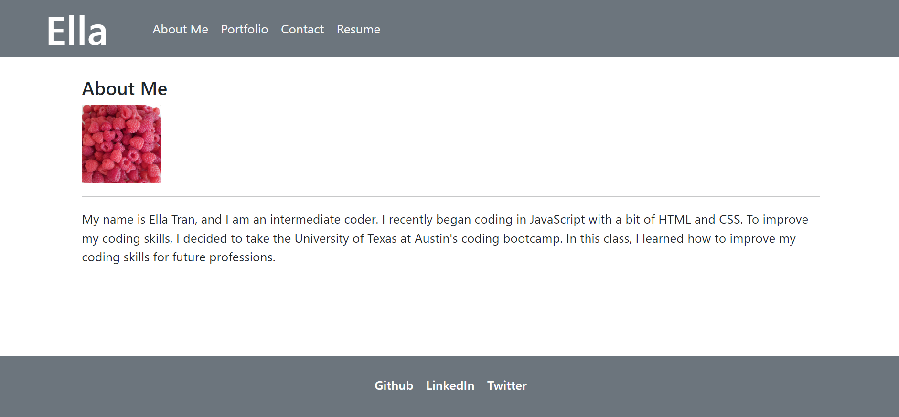

# React Portfolio

  # Table of Contents

  [Description](#description)  
  [Questions](#questions)  
  [Credit](#credit)  
  
  ## Description
  A portfolio to help familiarize myself with the indiivudal components of react's ability of put together pages and components render. Features simple put together profile page, conact, home, and resume, with an error page for any errors. 
  To run it, ensure all dependencies are installed through `npm install`, then run `npm start`, within your terminal.

  [Link to the webpage](https://playful-pothos-72e07b.netlify.app/)

  ## Questions
Githib: aceiln
Email: notarealemail@gmail.com
  ## License
     This project is covered under the MIT license